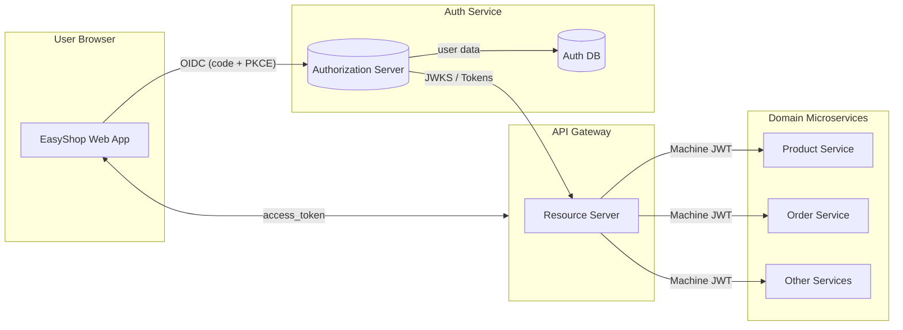
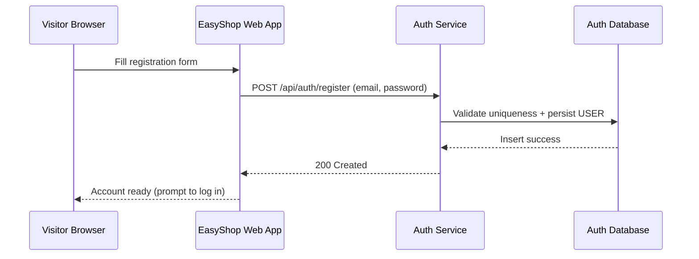
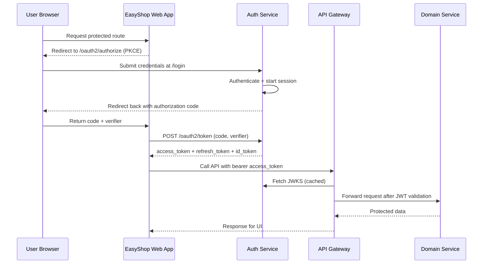

# easyshop-auth-service

## 1. Service Architecture

### 1.1 Core responsibilities
- Acts as the EasyShop OAuth 2.1 / OpenID Connect authority, issuing signed JWT access, refresh, and ID tokens via Spring Authorization Server.
- Stores user identities in the PostgreSQL `auth` schema (email, username, bcrypt hash, role, status flags) and exposes them through `UserDetailsService`.
- Exposes public REST endpoints for registration, credential validation, and password policy hints while delegating all interactive login to the authorization endpoints.

### 1.2 High-level topology

**Official references:**
- [Spring Authorization Server Reference](https://docs.spring.io/spring-authorization-server/reference/)
- [OAuth 2.0 Authorization Framework (RFC 6749)](https://datatracker.ietf.org/doc/html/rfc6749)
- [OAuth 2.0 for Native Apps (RFC 8252) & PKCE (RFC 7636)](https://datatracker.ietf.org/doc/html/rfc7636)
- [OpenID Connect Core 1.0](https://openid.net/specs/openid-connect-core-1_0.html)
- [JSON Web Token (RFC 7519) & JSON Web Key (RFC 7517)](https://datatracker.ietf.org/doc/html/rfc7519)

## 2. Authorization & Registration Flows

### 2.1 Self-service registration

### 2.2 Interactive login (Authorization Code + PKCE)

**Official references:**
- [OAuth 2.0 Authorization Framework – Section 4.1](https://datatracker.ietf.org/doc/html/rfc6749#section-4.1)
- [OpenID Connect Core 1.0 – Authorization Code Flow](https://openid.net/specs/openid-connect-core-1_0.html#CodeFlowSteps)
- [OpenID Connect RP-Initiated Logout 1.0](https://openid.net/specs/openid-connect-rpinitiated-1_0.html)
- [OWASP Cheat Sheet – User Registration](https://cheatsheetseries.owasp.org/cheatsheets/User_Registration_Cheat_Sheet.html)

## 3. Integration Landscape

- **easyshop-webapp**: OIDC client that handles `/callback`, caches tokens, renders user state (initials, menu) from ID token claims.
- **easyshop-api-gateway**: Resource server validating JWT signatures via JWKS, mapping scopes/roles, and acting as confidential client for internal calls.
- **Domain microservices**: Request machine tokens (client credentials) and rely on the gateway for request authentication/authorization.
- **External identity providers**: Architecture allows plugging Google, Apple, GitHub, VK, Yandex, etc., by registering additional clients and configuring upstream IdP integrations.

**Official references:**
- [Spring Security – Resource Server](https://docs.spring.io/spring-security/reference/servlet/oauth2/resource-server/index.html)
- [OAuth 2.0 Dynamic Client Registration Protocol (RFC 7591)](https://datatracker.ietf.org/doc/html/rfc7591)
- [OpenID Connect Discovery 1.0](https://openid.net/specs/openid-connect-discovery-1_0.html)
- [RFC 8705 – OAuth 2.0 Mutual-TLS Client Authentication](https://datatracker.ietf.org/doc/html/rfc8705)

## 4. Token Lifecycles & API Consumption

- **Registration**: `POST /api/auth/register` -> new row in `auth.user` -> interactive login via `/login` + OIDC.
- **Interactive login**: `/oauth2/authorize` -> `/login` -> `/oauth2/token` -> `access_token`, `id_token`, `refresh_token` stored by frontend.
- **Service-to-service**: Confidential clients call `/oauth2/token` with `client_credentials` -> attach machine access token to gateway calls.
- **Logout**: RP-initiated request to `/oauth2/logout?post_logout_redirect_uri=...` -> session cleared -> browser returned to webapp.

**Official references:**
- [OAuth 2.0 Authorization Framework – Section 4 (Grant Types)](https://datatracker.ietf.org/doc/html/rfc6749#section-4)
- [OAuth 2.0 Token Revocation (RFC 7009)](https://datatracker.ietf.org/doc/html/rfc7009)
- [OpenID Connect RP-Initiated Logout 1.0](https://openid.net/specs/openid-connect-rpinitiated-1_0.html)

## 5. Security Posture

### 5.1 Current safeguards
- Strong password policy with bcrypt hashing and validation endpoints for client UX.
- PKCE-enabled authorization code flow and signed RS256 JWTs validated by the gateway.
- Dedicated confidential clients for internal services with scoped access tokens and hourly TTL.

### 5.2 Observed gaps
- No email/phone verification before activating a new account.
- Login/register endpoints lack rate limiting and automated lockout for brute-force resistance.
- Manual role elevation and secret rotation; minimal audit trail for auth events.

### 5.3 Recommended improvements
1. Add out-of-band verification (email/SMS) and optional MFA (TOTP/WebAuthn), at least for admins.
2. Apply adaptive throttling and account lockout while preventing user enumeration leaks.
3. Rotate client secrets automatically via a managed vault and log all auth events centrally.
4. Provide back-channel logout or token revocation for immediate session invalidation.

**Official references:**
- [OWASP ASVS v4.0.3 – Sections 2 & 4](https://github.com/OWASP/ASVS)
- [OWASP Authentication Cheat Sheet](https://cheatsheetseries.owasp.org/cheatsheets/Authentication_Cheat_Sheet.html)
- [NIST SP 800-63B – Digital Identity Guidelines](https://pages.nist.gov/800-63-3/sp800-63b.html)
- [FIDO2 / WebAuthn Specifications](https://www.w3.org/TR/webauthn/)
